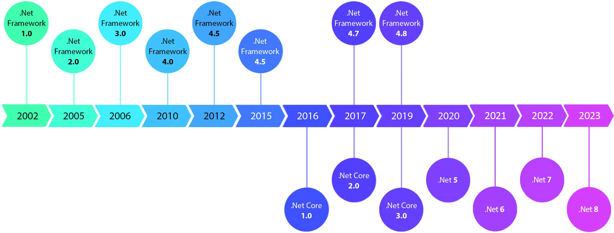
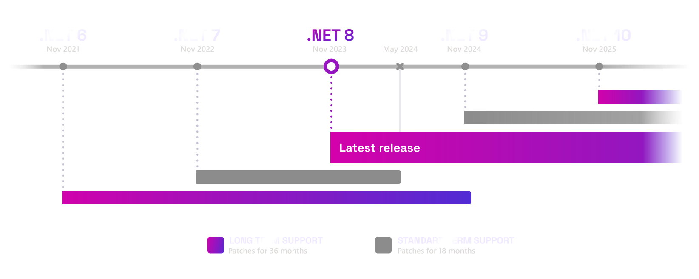

# .NET Framework to .NET Core Migration

This repository is comprised of a set of examples and supporting documentation to demonstrate major changes required when migrating a .NET Framework application to .NET "Core". In these examples, all examples are using .NET 8, but most concepts are available as of most recent major supported (and even unsupported) versions of .NET. 

## What is .NET "Core"?

.NET Core is a free, open-source, cross-platform framework for building modern applications. It supports the development of a wide range of application types including web, mobile, desktop, gaming, IoT, AI, and more. It was developed by Microsoft and the .NET community on GitHub.

It was designed as a brand-new framework, borrowing many concepts of .NET Framework to easy transition and familiarity for developers. OWIN, which aimed to decouple the application from the hosting platform by providing a common, agnostic, means of building components. It also introduced the concept of a middleware, which is a key part of the pipelining in .NET Core. It also provided a separation of concerns between web server communication/support and the application logic.

## Key Features of .NET Core

- **Cross-platform** - .NET Core can run on multiple platforms including Windows, macOS, and Linux.
- **Performance** - .NET Core has been designed to have a high performance and is continuously improved in each version.
- **Microservices Architecture** - .NET Core is ideal for microservices architecture which allows the deployment of a collection of small, loosely coupled services.
- **Open-Source** - .NET Core is open-source, allowing developers to contribute to its development and improvement.

## Naming and Versioning

The naming of .NET Core was intended to differentiate it from the original .NET Framework, which is primarily Windows-based. The "Core" signifies that it is a stripped-down version of the framework, focusing on the core features that can be shared across different platforms.

The versioning of .NET Core started with 1.0, and major updates have incremented the major version number (e.g., 2.0, 3.0). Minor updates increment the minor version number (e.g., 3.1, 3.2). In 2020, Microsoft consolidated .NET Core and other .NET technologies into a single platform called .NET 5.0. The name ".NET 5" was chosen to avoid confusion with .NET Framework, which already had a version 4.8. The versioning for .NET 5 and onwards follows the same major and minor pattern without the "Core" branding.

## Support Lifecycle

Different versions of .NET releases offer different support windows. Currently, even-numbered releases are offered with LTS (Long Term Support) of 3 years from the date of release, while odd-numbered releases are offered with STS (Standard Term Support) of 18 months. 

Currently, a new major version of .NET is released every year, typically in November. 

## Limitations in .NET Framework

The .NET Framework, while robust and widely used, had several limitations:

1. **Versioning Complexities** - The .NET Framework had issues with versioning, where different versions of the framework could not easily coexist on the same machine.
2. **Performance Trade-offs** - The .NET Framework was not as performant as it could be, especially in terms of startup times and memory usage.
3. **Vendor Lock-in** - The .NET Framework was Windows-only, which limited its use to Windows-based systems. This also increases licensing costs due to the cost of the Windows OS.
4. **Stability Issues for New Releases** - New releases of the .NET Framework often introduced breaking changes. Major versions were few and far between, resulting in major changes between these versions.

.NET Core addressed many of these limitations:

1. **Cross-Platform** - .NET Core is cross-platform, running on Windows, Linux, and macOS.
2. **Improved Performance** - .NET Core has significant performance improvements over the .NET Framework.
3. **Modular Design** - .NET Core’s modular design contributes to faster startup times and improved overall performance.
4. **Open Source** - .NET Core is open source, allowing for community contributions and improvements.
5. **Standalone and Side-by-Side Installation** - .NET Core supports standalone deployment, meaning an app and its dependencies can be bundled together and deployed on any platform. This also allows for side-by-side installations where different versions of .NET Core can coexist on the same machine.
6. **Faster Iteration** - A new version of .NET is released every year, with STS versions (currently 7 and 9) of 18 months from date of release, with LTS versions (currently versions 6 and 8) offering support for 3 years.

## Unsupported Scenarios

When migrating from .NET Framework to .NET Core, there are several scenarios or features that may not be directly supported or may require modification due to differences between the two frameworks. Here are some examples:

1. **Windows Forms and WPF** - .NET Core initially did not support Windows Forms and WPF projects, although support for these UI frameworks was later added in .NET Core 3.0 and later versions. However, there might still be some differences in behavior or features compared to the .NET Framework versions.
  
2. **ASP.NET Web Forms** - ASP.NET Web Forms projects are not directly supported in .NET Core. Migration typically involves rewriting the application using ASP.NET Core MVC, Razor Pages, or Blazor.
  
3. **Remoting** - .NET Remoting, a technology for communication between application domains or processes, is not supported in .NET Core. Alternatives such as gRPC or RESTful APIs are recommended for inter-process communication in .NET Core.
  
4. **AppDomains** - .NET Core does not support AppDomains, which are used for isolation and management of application domains in .NET Framework. This may require changes in how application components are organized and loaded.
  
5. **Third-party libraries** - Some third-party libraries or components designed specifically for .NET Framework may not be compatible with .NET Core. Developers may need to find alternative libraries or update existing ones to support .NET Core.
  
6. **System.Configuration** - .NET Core does not include System.Configuration, which is commonly used for reading configuration settings from XML files. Configuration in .NET Core is typically done using JSON files, environment variables, or other configuration providers. 
  
7. **Windows-specific APIs** - .NET Core is cross-platform and does not include all Windows-specific APIs available in .NET Framework. If an application relies heavily on Windows-specific functionality, it may require modifications or alternative approaches when migrating to .NET Core.

    - **MSMQ** - .NET Core no longer supports MSMQ, not only because it is a Windows-specific technology, but also because in a cloud-focused landscape, better alternatives exist that are cross-platform (and multi-cloud). Popular alternatives include RabbitMQ, NServiceBus, Azure Service Bus, or SQL Server Broker Services. 

    - **MSDTC** - Microsoft Distributed Transaction Coordinator, while is technically supported, is tightly coupled with Windows and is availabiel **only for Windows hosting environments**. Attempts to deploy code that leverages `TransactionScope` on multiple (distributed) database connections will throw an exception.

8. **COM interop** - COM interop, used for communication with COM objects, is not directly supported in .NET Core. Developers may need to find alternative approaches or use .NET Framework for components that rely on COM interop.

## Windows Compatibility Pack

While .NET Core aims to be agnostic in its ability to be hosted on multiple platforms, packages such as the **[Microsoft.Windows.Compatibility](https://www.nuget.org/packages/Microsoft.Windows.Compatibility)** NuGet package exist to help ease the transition. This package offers about 20,000 additional APIs, including Windows-only functionality and support for the Windows-only APIs such as:

- Registry
- Event Log
- Performance Counters
- Directory Services
- ODBC
- CodeDom

More Information: **[Use the Windows Compatibility Pack to port code to .NET](https://learn.microsoft.com/en-us/dotnet/core/porting/windows-compat-pack)**

### Links

- [.NET and .NET Core Support Policy](https://dotnet.microsoft.com/en-us/platform/support/policy/dotnet-core)

## Examples

- [Configuration](./Configuration/) - Demonstrates the use of multiple configuration sources, specifically in-memory, JSON, and INI files, as well as the ability to load a typed `IOptions<T>` instance from the configuration store. In addition, you can load in configuration values from environment variables and the command line with one line of code.
- [Session](./Session/) - Demonstrates the changes made to session and how to use the new `ISession` interface to get and set session data.
- [CustomMiddleware](./CustomMiddleware/) - Demonstrates how to define and customize the middleware pipeline, similar to HttpModules.
- [DependencyInjection](./DependencyInjection/) - Demonstrates how to use the new (native) dependency injection functionality in a Web API project.

## Links (unsorted)

- [Top-level statements - programs without `Main` methods](https://learn.microsoft.com/en-us/dotnet/csharp/fundamentals/program-structure/top-level-statements)
- [Windows Compatibility Pack for .NET](https://devblogs.microsoft.com/dotnet/announcing-the-windows-compatibility-pack-for-net-core/)